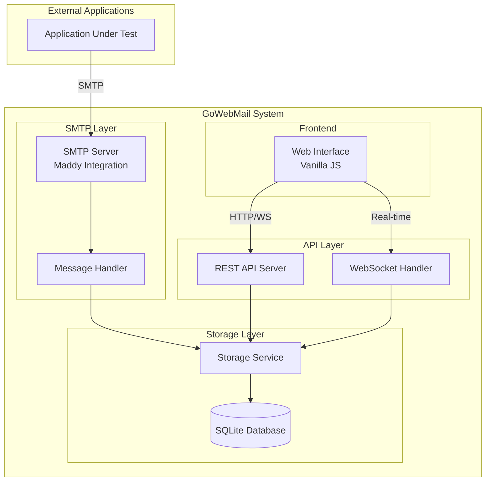
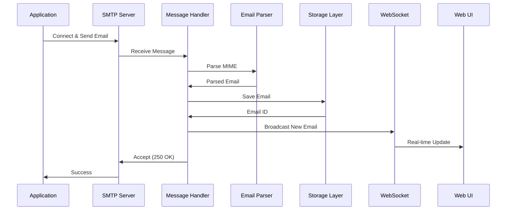

# GoWebMail - Email Testing Tool Architecture

## Overview

GoWebMail is a complete email testing tool similar to MailSlurper, built using Maddy mail server as the backend foundation. It captures all outgoing SMTP emails in development environments and provides a modern web interface for viewing, searching, and managing captured messages.

## System Architecture



## Component Design

### 1. SMTP Layer (Maddy Integration)

**Purpose**: Accept and process incoming SMTP connections

**Key Components**:
- Custom Maddy module integration
- SMTP message parser
- Message interceptor/handler

**Responsibilities**:
- Listen on configurable SMTP port (default: 1025)
- Accept all incoming mail without authentication
- Parse SMTP envelope and message content
- Extract headers, body, attachments
- Pass messages to storage layer

**Technical Details**:
- Embed Maddy as Go library
- Create custom delivery module
- No authentication required for development use
- Support for SMTP, ESMTP protocols
- Handle multipart MIME messages

### 2. Storage Layer

**Purpose**: Persist and retrieve email messages

**Database Schema** (SQLite):

```sql
-- Emails table
CREATE TABLE emails (
    id INTEGER PRIMARY KEY AUTOINCREMENT,
    message_id TEXT UNIQUE,
    from_address TEXT NOT NULL,
    to_addresses TEXT NOT NULL,  -- JSON array
    cc_addresses TEXT,            -- JSON array
    bcc_addresses TEXT,           -- JSON array
    subject TEXT,
    body_plain TEXT,
    body_html TEXT,
    headers TEXT NOT NULL,        -- JSON object
    attachments TEXT,             -- JSON array of attachment metadata
    size INTEGER,
    received_at DATETIME DEFAULT CURRENT_TIMESTAMP,
    read BOOLEAN DEFAULT 0,
    INDEX idx_from (from_address),
    INDEX idx_to (to_addresses),
    INDEX idx_subject (subject),
    INDEX idx_received (received_at)
);

-- Attachments table
CREATE TABLE attachments (
    id INTEGER PRIMARY KEY AUTOINCREMENT,
    email_id INTEGER NOT NULL,
    filename TEXT NOT NULL,
    content_type TEXT,
    size INTEGER,
    data BLOB,
    FOREIGN KEY (email_id) REFERENCES emails(id) ON DELETE CASCADE
);

-- Configuration table
CREATE TABLE config (
    key TEXT PRIMARY KEY,
    value TEXT NOT NULL
);
```

**Storage Service Interface**:
```go
type StorageService interface {
    SaveEmail(email *Email) error
    GetEmail(id int64) (*Email, error)
    ListEmails(filter *EmailFilter, limit, offset int) ([]*Email, error)
    SearchEmails(query string) ([]*Email, error)
    DeleteEmail(id int64) error
    DeleteAllEmails() error
    GetEmailCount() (int64, error)
    GetAttachment(id int64) (*Attachment, error)
}
```

**Features**:
- Full-text search on subject, from, to, body
- Pagination support
- Filtering by date range, sender, recipient
- Automatic cleanup based on retention policies
- Transaction support for data integrity

### 3. REST API Layer

**Purpose**: Provide HTTP endpoints for email management

**API Endpoints**:

```
GET    /api/emails              - List emails (with pagination, filtering)
GET    /api/emails/:id          - Get single email details
DELETE /api/emails/:id          - Delete single email
DELETE /api/emails              - Delete all emails
GET    /api/emails/search       - Search emails
GET    /api/emails/:id/raw      - Get raw email source
GET    /api/emails/:id/html     - Get HTML body (sanitized)
GET    /api/emails/:id/attachments/:aid - Download attachment
GET    /api/stats               - Get statistics (count, size, etc.)
GET    /api/health              - Health check endpoint
```

**Query Parameters**:
- `limit`: Number of results (default: 50, max: 100)
- `offset`: Pagination offset
- `from`: Filter by sender
- `to`: Filter by recipient
- `subject`: Filter by subject (partial match)
- `since`: Filter by date (ISO 8601)
- `until`: Filter by date (ISO 8601)
- `q`: Full-text search query

**Response Format** (JSON):
```json
{
  "success": true,
  "data": {
    "emails": [...],
    "total": 42,
    "limit": 50,
    "offset": 0
  }
}
```

**Error Response**:
```json
{
  "success": false,
  "error": {
    "code": "NOT_FOUND",
    "message": "Email not found"
  }
}
```

### 4. WebSocket Layer

**Purpose**: Real-time updates for new emails

**WebSocket Endpoint**: `/ws`

**Message Types**:
```json
// Server -> Client: New email received
{
  "type": "email.new",
  "data": {
    "id": 123,
    "from": "sender@example.com",
    "subject": "Test Email",
    "receivedAt": "2026-01-02T15:30:00Z"
  }
}

// Server -> Client: Email deleted
{
  "type": "email.deleted",
  "data": {
    "id": 123
  }
}

// Server -> Client: All emails deleted
{
  "type": "emails.cleared"
}
```

**Features**:
- Automatic reconnection on disconnect
- Heartbeat/ping-pong for connection health
- Broadcast to all connected clients
- No authentication required (development tool)

### 5. Frontend UI

**Purpose**: User interface for viewing and managing emails

**Technology Stack**:
- Vanilla JavaScript (ES6+)
- Modern CSS (Grid, Flexbox)
- No framework dependencies
- WebSocket for real-time updates

**UI Components**:

1. **Email List View**
   - Inbox-style table/list
   - Columns: From, Subject, Date, Size
   - Row selection
   - Unread indicator
   - Sorting by column
   - Infinite scroll or pagination

2. **Email Preview Pane**
   - Split view (list + preview)
   - Tabs for HTML/Plain text/Raw
   - Header display (From, To, CC, BCC, Date, Subject)
   - Attachment list with download links
   - HTML sanitization for safe rendering

3. **Search Bar**
   - Real-time search
   - Filter by sender, recipient, subject
   - Date range picker
   - Clear filters button

4. **Toolbar**
   - Delete selected button
   - Delete all button (with confirmation)
   - Refresh button
   - Settings button

5. **Statistics Panel**
   - Total emails count
   - Total storage size
   - Emails today count

**File Structure**:
```
web/
├── index.html
├── css/
│   ├── main.css
│   ├── email-list.css
│   └── email-preview.css
├── js/
│   ├── app.js           # Main application
│   ├── api.js           # API client
│   ├── websocket.js     # WebSocket handler
│   ├── email-list.js    # Email list component
│   ├── email-preview.js # Preview component
│   ├── search.js        # Search functionality
│   └── utils.js         # Utility functions
└── assets/
    └── icons/
```

## Project Structure

```
gowebmail/
├── cmd/
│   └── gowebmail/
│       └── main.go              # Application entry point
├── internal/
│   ├── config/
│   │   ├── config.go            # Configuration management
│   │   └── defaults.go          # Default values
│   ├── smtp/
│   │   ├── server.go            # SMTP server setup
│   │   ├── handler.go           # Message handler
│   │   └── maddy.go             # Maddy integration
│   ├── storage/
│   │   ├── storage.go           # Storage interface
│   │   ├── sqlite.go            # SQLite implementation
│   │   ├── models.go            # Data models
│   │   └── migrations.go        # Database migrations
│   ├── api/
│   │   ├── server.go            # HTTP server
│   │   ├── handlers.go          # API handlers
│   │   ├── middleware.go        # Middleware (CORS, logging, auth)
│   │   ├── websocket.go         # WebSocket handler
│   │   └── routes.go            # Route definitions
│   ├── email/
│   │   ├── parser.go            # Email parsing
│   │   ├── sanitizer.go         # HTML sanitization
│   │   └── models.go            # Email models
│   └── retention/
│       └── policy.go            # Retention policy enforcement
├── web/                         # Frontend files (as above)
├── docs/
│   ├── API.md                   # API documentation
│   ├── CONFIGURATION.md         # Configuration guide
│   └── USAGE.md                 # Usage examples
├── docker/
│   ├── Dockerfile
│   └── docker-compose.yml
├── configs/
│   └── gowebmail.example.yml   # Example configuration
├── scripts/
│   ├── build.sh
│   └── test.sh
├── go.mod
├── go.sum
├── README.md
└── LICENSE
```

## Configuration System

**Configuration File** (`gowebmail.yml`):

```yaml
# SMTP Server Configuration
smtp:
  host: "0.0.0.0"
  port: 1025
  max_message_size: 10485760  # 10MB in bytes
  timeout: 30s

# HTTP Server Configuration
http:
  host: "0.0.0.0"
  port: 8080
  read_timeout: 30s
  write_timeout: 30s

# Storage Configuration
storage:
  type: "sqlite"
  path: "./data/gowebmail.db"
  
# Retention Policy
retention:
  enabled: true
  max_age: "7d"           # Keep emails for 7 days
  max_count: 1000         # Keep max 1000 emails
  cleanup_interval: "1h"  # Run cleanup every hour

# Web Interface
web:
  enabled: true
  auth:
    enabled: false
    username: "admin"
    password: "changeme"  # Only if auth enabled

# Logging
logging:
  level: "info"           # debug, info, warn, error
  format: "json"          # json or text
  output: "stdout"        # stdout or file path
```

**Environment Variables** (override config file):
- `GOWEBMAIL_SMTP_PORT`
- `GOWEBMAIL_HTTP_PORT`
- `GOWEBMAIL_STORAGE_PATH`
- `GOWEBMAIL_LOG_LEVEL`
- `GOWEBMAIL_WEB_AUTH_ENABLED`
- `GOWEBMAIL_WEB_AUTH_USERNAME`
- `GOWEBMAIL_WEB_AUTH_PASSWORD`

## Key Features Implementation

### 1. Email Capture Flow



### 2. Search Implementation

**Full-Text Search Strategy**:
- Use SQLite FTS5 virtual table for efficient full-text search
- Index: subject, from_address, to_addresses, body_plain
- Support for phrase queries, prefix matching
- Ranking by relevance

**Alternative**: Simple LIKE queries for basic filtering

### 3. HTML Email Rendering

**Security Considerations**:
- Sanitize HTML to prevent XSS
- Remove JavaScript
- Remove external resource loading (images, CSS)
- Use Content Security Policy headers
- Render in sandboxed iframe

**Library**: Use Go HTML sanitizer (bluemonday)

### 4. Attachment Handling

**Storage**:
- Store in database BLOB for small files (< 1MB)
- Store on filesystem for larger files
- Reference in database with path

**Download**:
- Stream directly from storage
- Set appropriate Content-Type headers
- Support Content-Disposition for download

### 5. Real-time Updates

**Implementation**:
- WebSocket connection pool
- Broadcast channel for new emails
- Automatic reconnection on client side
- Heartbeat every 30 seconds

## Docker Support

### Dockerfile

```dockerfile
FROM golang:1.25-alpine AS builder
WORKDIR /build
COPY go.mod go.sum ./
RUN go mod download
COPY . .
RUN CGO_ENABLED=1 go build -o gowebmail ./cmd/gowebmail

FROM alpine:latest
RUN apk --no-cache add ca-certificates sqlite
WORKDIR /app
COPY --from=builder /build/gowebmail .
COPY web ./web
COPY configs/gowebmail.example.yml ./gowebmail.yml
EXPOSE 1025 8080
VOLUME ["/app/data"]
CMD ["./gowebmail"]
```

### docker-compose.yml

```yaml
version: '3.8'

services:
  gowebmail:
    build: .
    ports:
      - "1025:1025"  # SMTP
      - "8080:8080"  # HTTP
    volumes:
      - ./data:/app/data
      - ./configs/gowebmail.yml:/app/gowebmail.yml
    environment:
      - GOWEBMAIL_LOG_LEVEL=info
    restart: unless-stopped
```

## Error Handling Strategy

### SMTP Layer
- Log all errors with context
- Return appropriate SMTP error codes
- Never crash on malformed messages
- Graceful degradation

### API Layer
- Consistent error response format
- HTTP status codes (400, 404, 500)
- Detailed error messages in development
- Generic messages in production

### Storage Layer
- Transaction rollback on errors
- Database connection retry logic
- Graceful handling of disk full
- Data integrity checks

## Logging Strategy

**Structured Logging**:
- Use structured logger (zerolog or zap)
- Include request ID for tracing
- Log levels: DEBUG, INFO, WARN, ERROR
- Contextual information (email ID, client IP)

**Log Events**:
- SMTP connection established/closed
- Email received and stored
- API requests (with timing)
- Errors and warnings
- Startup/shutdown events

## Graceful Shutdown

**Shutdown Sequence**:
1. Stop accepting new SMTP connections
2. Wait for in-flight SMTP transactions (max 30s)
3. Stop accepting new HTTP requests
4. Wait for in-flight HTTP requests (max 30s)
5. Close WebSocket connections gracefully
6. Close database connections
7. Flush logs
8. Exit

**Signal Handling**:
- SIGTERM: Graceful shutdown
- SIGINT: Graceful shutdown
- SIGKILL: Immediate termination (not catchable)

## Performance Considerations

### Database Optimization
- Indexes on frequently queried columns
- Connection pooling
- Prepared statements
- Batch operations for cleanup

### Memory Management
- Stream large emails instead of loading fully
- Limit concurrent SMTP connections
- WebSocket connection limits
- Email size limits

### Caching
- Cache email count for statistics
- Cache recent emails list
- Invalidate on new email or deletion

## Security Considerations

### Development Tool Notice
- Clear documentation: NOT for production use
- No encryption by default
- Optional basic auth for web interface
- Bind to localhost by default

### Web Interface
- CORS configuration
- XSS prevention (HTML sanitization)
- CSRF protection (if auth enabled)
- Rate limiting on API endpoints

### SMTP Server
- Message size limits
- Connection limits
- Timeout configurations
- No relay functionality

## Testing Strategy

### Unit Tests
- Storage layer operations
- Email parsing
- API handlers
- Configuration loading

### Integration Tests
- SMTP message flow
- API endpoints
- WebSocket communication
- Database operations

### E2E Tests
- Send email via SMTP
- Verify in web interface
- Search and filter
- Delete operations

## Deployment Scenarios

### 1. Local Development
```bash
# Start server
./gowebmail

# Configure application to use SMTP
export SMTP_HOST=localhost
export SMTP_PORT=1025
```

### 2. Docker Compose
```bash
docker-compose up -d
```

### 3. CI/CD Pipeline
```yaml
# .gitlab-ci.yml example
services:
  - name: gowebmail:latest
    alias: mailserver

variables:
  SMTP_HOST: mailserver
  SMTP_PORT: 1025
```

### 4. Kubernetes
```yaml
apiVersion: v1
kind: Service
metadata:
  name: gowebmail
spec:
  ports:
  - name: smtp
    port: 1025
  - name: http
    port: 8080
  selector:
    app: gowebmail
```

## Future Enhancements

- [ ] Multiple storage backends (PostgreSQL, MySQL)
- [ ] Email forwarding/relay capability
- [ ] Export emails (mbox, EML format)
- [ ] Advanced filtering (regex, boolean operators)
- [ ] Email templates for testing
- [ ] API client libraries (Go, Python, JavaScript)
- [ ] Metrics and monitoring (Prometheus)
- [ ] Multi-user support with separate inboxes
- [ ] Email threading/conversation view
- [ ] Dark mode for web interface

## Dependencies

### Go Dependencies
```
github.com/foxcpp/maddy          # SMTP server
github.com/mattn/go-sqlite3      # SQLite driver
github.com/gorilla/mux           # HTTP router
github.com/gorilla/websocket     # WebSocket
github.com/microcosm-cc/bluemonday # HTML sanitizer
github.com/rs/zerolog            # Structured logging
gopkg.in/yaml.v3                 # YAML config
github.com/emersion/go-message   # Email parsing
```

### Frontend Dependencies
- No external dependencies (vanilla JavaScript)
- Modern browser required (ES6+ support)

## Success Metrics

- Single binary deployment
- < 50MB memory usage (idle)
- < 100ms API response time
- Support 1000+ emails without performance degradation
- Real-time updates < 100ms latency
- Zero configuration for basic usage
- Cross-platform support (Linux, macOS, Windows)
